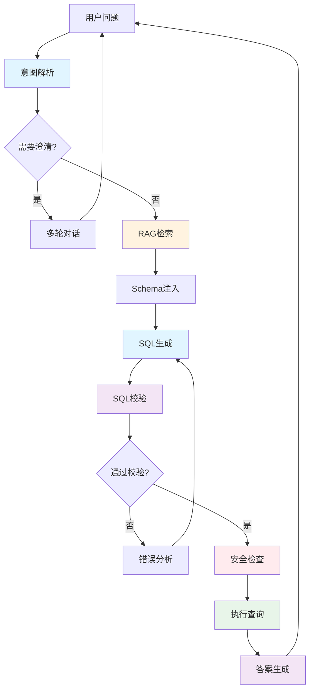

# NL2SQL 系统概述

在开始编码之前，让我们先理解：**什么是NL2SQL系统**，以及**为什么构建它并不简单**。

## 什么是 NL2SQL

**NL2SQL** (Natural Language to SQL) 是指将自然语言问题转换为SQL查询的技术。

### 简单示例

**用户问题**：
```
查询销售额最高的前10个客户
```

**系统生成SQL**：
```sql
SELECT customer_name, SUM(amount) as total_sales
FROM orders
GROUP BY customer_name
ORDER BY total_sales DESC
LIMIT 10;
```

**返回结果**：
```
客户A: ¥150,000
客户B: ¥120,000
...
```

## 为什么需要 NL2SQL

### 传统方式的痛点

❌ **普通用户不会SQL**
- 业务人员想查数据，必须找技术人员
- 数据分析师需要学习SQL语法
- 临时查询需求响应慢

❌ **固定报表不够灵活**
- BI报表只能看预设维度
- 临时分析需求无法快速满足
- 每次新需求都要开发

### NL2SQL的价值

✅ **降低使用门槛**
- 用自然语言描述需求即可
- 无需学习SQL语法
- 人人都能查数据

✅ **提升响应速度**
- 即问即答，无需等待开发
- 支持临时性分析需求
- 大幅提升数据使用效率

✅ **释放数据价值**
- 让更多人参与数据分析
- 促进数据驱动决策
- 提升组织整体数据素养

## 为什么不简单

你可能会想：现在LLM这么强大，调用一下API不就行了？

**事实并非如此。**

### 挑战1: Schema理解

**问题**：LLM如何知道你的数据库结构？

```python
# 用户问：查询VIP客户的订单
# 但LLM不知道：
# - 有哪些表？
# - VIP客户存在customer表还是vip_customer表？
# - 订单表叫orders还是order_info？
# - 字段名是什么？
```

**解决方案** (M3模块)：
- 自动抽取数据库Schema
- 注入到Prompt中
- 支持字段检索与匹配

### 挑战2: SQL质量保证

**问题**：LLM生成的SQL可能有错

```sql
-- 列名写错
SELECT customer_namee FROM orders  -- namee拼写错误

-- 聚合错误
SELECT customer_name, SUM(amount), order_date
FROM orders
GROUP BY customer_name  -- order_date没有GROUP BY

-- 语法错误
SELECT * FROM orders WHERE amount > ;  -- 缺少值
```

**解决方案** (M4模块)：
- SQL语法验证 (sqlglot)
- 自动修复机制
- LLM自我反思与改进

### 挑战3: 执行安全

**问题**：如果用户问出恶意问题怎么办？

```sql
-- 数据泄露
SELECT * FROM user_password;

-- 数据破坏
DROP TABLE orders;

-- 性能攻击
SELECT * FROM orders JOIN customers JOIN products;  -- 百万级笛卡尔积
```

**解决方案** (M5模块)：
- 只读账户权限
- SQL关键字白名单
- 结果行数限制
- 执行超时控制

### 挑战4: 行业黑话

**问题**：业务术语LLM可能不理解

```
用户：查询铁粉的复购率
# LLM不知道：
# - "铁粉" = 忠诚客户 (购买次数>=5)
# - "复购率" = 二次及以上购买的客户占比
```

**解决方案** (M6模块)：
- 构建业务术语词典
- 使用RAG检索相关定义
- 历史SQL模板复用

### 挑战5: 意图模糊

**问题**：用户问题不明确

```
用户：查询销售额
# 哪个时间段？
# 按什么维度分组？
# 包括退款吗？
```

**解决方案** (M7模块)：
- 检测问题模糊点
- 生成澄清问题
- 多轮对话补全信息

### 挑战6: 复杂查询

**问题**：多表联结需要理解表关系

```
查询购买过iPhone的北京用户的平均年龄

-- 需要JOIN：
- users表 (年龄、城市)
- orders表 (用户ID)
- products表 (产品名称)

-- 且要理解：
- 用户和订单的外键关系
- 订单和产品的关联关系
```

**解决方案** (M8模块)：
- 自动分析表关系
- 提供JOIN路径提示
- Few-shot示例学习

## NL2SQL 系统架构

一个完整的NL2SQL系统应该包含以下组件：



### 核心流程

1. **意图解析** (M0)：理解用户问题类型
2. **澄清对话** (M7)：处理模糊问题
3. **RAG增强** (M6)：检索业务知识和历史SQL
4. **Schema注入** (M3)：提供数据库结构信息
5. **SQL生成** (M1)：通过Prompt生成SQL
6. **SQL校验** (M4)：验证语法和逻辑
7. **安全检查** (M5)：防止危险操作
8. **执行查询** (M2)：通过Function Call执行
9. **答案生成** (M9)：将结果转为自然语言

## 本课程的系统设计

我们将使用 **LangGraph** 构建这个系统，原因是：

### ✅ 状态可控
每个节点的输入输出都是明确的State，便于调试和维护。

### ✅ 流程可追踪
可以清楚地看到请求经过了哪些节点，每个节点做了什么。

### ✅ 支持循环
SQL校验失败可以返回生成节点重试，而不是简单的链式调用。

### ✅ 易于扩展
新增功能只需添加新节点，不影响现有逻辑。

### State 设计

```python
class NL2SQLState(TypedDict):
    # 用户输入
    question: str

    # 意图与上下文 (M0, M7)
    intent: Dict
    dialog_history: List

    # Schema与知识 (M3, M6)
    schema: Dict
    rag_evidence: List

    # SQL生成 (M1, M4)
    candidate_sql: str
    validation: Dict

    # 执行结果 (M2, M5)
    execution: Dict

    # 最终输出 (M9)
    answer: str

    # 可观测性 (M11)
    trace: List
```

## 评价指标

如何评估NL2SQL系统的好坏？

### Exact Match (EM)
生成的SQL与标准答案完全一致的比例。

```
EM = 正确SQL数 / 总问题数
```

### Execution Accuracy (EX)
执行结果与标准答案一致的比例（SQL不同但结果对也算对）。

```
EX = 结果正确数 / 总问题数
```

**一般 EX > EM**，因为同一个问题可能有多种正确的SQL写法。

### 其他指标
- **响应时间**：平均查询耗时
- **成本**：每次查询的Token消耗
- **安全性**：拦截恶意查询的成功率

## 典型应用场景

### 1. 企业BI助手
```
用户: 本季度各区域销售额对比
系统: [生成SQL] → [执行] → [图表展示]
```

### 2. 数据探索工具
```
分析师: 找出流失率最高的用户群体
系统: [多轮澄清] → [生成分析SQL] → [解释结果]
```

### 3. 客服智能查询
```
客服: 查询张三的订单状态
系统: [生成SQL] → [返回订单信息]
```

### 4. 报表生成系统
```
管理者: 生成上月运营报告
系统: [生成多个SQL] → [汇总数据] → [生成报告]
```

## 行业现状

### 学术界
- **Spider数据集**：跨域NL2SQL基准
- **BIRD数据集**：大规模复杂数据库
- **当前SOTA**：GPT-4约80% EX (Spider)

### 工业界
- **阿里云QuickBI**：集成NL2SQL能力
- **微软PowerBI**：Copilot自然语言查询
- **Tableau**：Ask Data功能
- **各大数据库厂商**：纷纷推出NL2SQL产品

### 开源方案
- **Vanna.ai**：简单的NL2SQL框架
- **DB-GPT**：数据库智能助手
- **本课程**：LangGraph版本，更可控、更灵活

## 总结

构建生产级NL2SQL系统需要考虑：

1. **Schema理解** - 让LLM知道数据库结构
2. **SQL质量** - 确保生成的SQL正确
3. **执行安全** - 防止危险操作
4. **业务语义** - 理解行业黑话
5. **对话能力** - 处理模糊问题
6. **复杂查询** - 支持多表JOIN
7. **结果呈现** - 友好的输出格式
8. **系统工程** - 评测、日志、部署

本课程将**逐一攻克**这些挑战，带你构建一个完整的NL2SQL解决方案！

---

**下一步**：
- 👉 [了解技术栈](/guide/tech-stack)
- 👉 [环境准备](/guide/setup)
- 👉 [开始M0模块](/modules/m0/overview)
