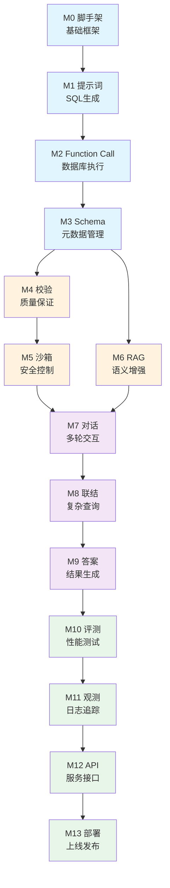

# 模块列表

本课程包含13个渐进式模块，从脚手架到部署，涵盖NL2SQL系统的完整生命周期。

## 学习路径

### 📘 基础篇 (M0-M3)

构建NL2SQL系统的基础框架，实现最简单的自然语言到SQL转换。

| 模块 | 名称 | 核心内容 | 学习时长 |
|------|------|---------|---------|
| **M0** | [项目脚手架](./m0/overview.md) | LangGraph基础、配置系统、State设计 | 2-3小时 |
| **M1** | [提示词工程](./m1/overview.md) | Prompt设计、Few-shot学习、SQL生成 | 3-4小时 |
| **M2** | [Function Call](./m2/overview.md) | 工具调用、数据库执行、结果处理 | 2-3小时 |
| **M3** | [Schema感知](./m3/overview.md) | 元数据抽取、Schema注入、字段匹配 | 3-4小时 |

### 🔥 增强篇 (M4-M6)

提升系统的质量、安全性和智能化水平。

| 模块 | 名称 | 核心内容 | 学习时长 |
|------|------|---------|---------|
| **M4** | [SQL校验](./m4/overview.md) | 语法验证、自我修复、错误分析 | 3-4小时 |
| **M5** | [执行沙箱](./m5/overview.md) | 安全控制、权限隔离、风险拦截 | 2-3小时 |
| **M6** | [RAG增强](./m6/overview.md) | 向量检索、行业黑话、历史SQL复用 | 4-5小时 |

### 🚀 进阶篇 (M7-M9)

支持复杂场景，提升用户体验。

| 模块 | 名称 | 核心内容 | 学习时长 |
|------|------|---------|---------|
| **M7** | [多轮对话](./m7/overview.md) | 意图澄清、上下文管理、对话状态 | 3-4小时 |
| **M8** | [多表联结](./m8/overview.md) | JOIN生成、表关系分析、复杂SQL | 4-5小时 |
| **M9** | [答案生成](./m9/overview.md) | 结果解释、自然语言回答、SQL溯源 | 2-3小时 |

### 🛠️ 工程篇 (M10-M13)

走向生产环境，构建企业级系统。

| 模块 | 名称 | 核心内容 | 学习时长 |
|------|------|---------|---------|
| **M10** | [系统评测](./m10/overview.md) | 测试集构建、指标计算、性能优化 | 3-4小时 |
| **M11** | [可观测性](./m11/overview.md) | 日志系统、链路追踪、调试工具 | 2-3小时 |
| **M12** | [API & UI](./m12/overview.md) | FastAPI服务、前端界面、接口设计 | 4-5小时 |
| **M13** | [部署](./m13/overview.md) | Docker容器化、配置管理、一键部署 | 3-4小时 |

## 快速导航

### 🎯 我想...

**了解基础**
- → [什么是NL2SQL](/guide/nl2sql-overview)
- → [技术栈介绍](/guide/tech-stack)
- → [环境准备](/guide/setup)

**开始学习**
- → [M0: 项目脚手架](./m0/overview.md) ⭐ 从这里开始
- → [M1: 提示词工程](./m1/overview.md)
- → [M6: RAG增强](./m6/overview.md) 热门模块

**查看代码**
- → [GitHub仓库](https://github.com/yourusername/rookie-nl2sql)
- → [代码结构说明](./m0/project-structure.md)
- → [配置系统](./m0/configuration.md)

**解决问题**
- → [常见问题 FAQ](#常见问题)
- → [GitHub Issues](https://github.com/yourusername/rookie-nl2sql/issues)

## 模块依赖关系



## 学习建议

### 按顺序学习 (推荐)
每个模块都基于前一个模块，建议从M0开始按顺序学习。

### 跳跃学习
如果你已经有一定基础，可以：
- **有LangGraph经验** → 从M1开始
- **只想了解RAG** → 直接学M6 (但建议先看M0-M3)
- **关注工程化** → M10-M13

### 学习节奏
- **密集学习**: 每天2-3个模块，2周完成
- **稳步推进**: 每天1个模块，2-3周完成
- **自定节奏**: 根据自己时间安排

## 实践方式

每个模块都包含：

### 📖 理论文档
- 模块概述：为什么需要这个功能
- 技术细节：如何实现
- 设计思路：为什么这样设计

### 💻 代码实现
```bash
# 切换到对应分支
git checkout 00-scaffold  # M0
git checkout 01-prompt-nl2sql  # M1
...
```

### ✅ 验收测试
```bash
# 运行自动化测试
python tests/test_m0_acceptance.py
```

### 🎯 实践任务
每个模块2-3个动手任务，举一反三。

## 常见问题

### Q: 必须按顺序学吗？
A: 建议按顺序，但如果你有基础，可以跳过某些模块。每个模块的依赖关系见上图。

### Q: 需要多长时间？
A: 快速通关2周，深度学习4周。每个模块2-5小时不等。

### Q: 代码在哪里？
A: 每个模块对应一个Git分支。`git checkout <分支名>` 查看代码。

### Q: 我卡住了怎么办？
A:
1. 查看模块文档和代码注释
2. 运行验收测试看错误信息
3. 查看GitHub Issues
4. 提问（欢迎提Issue）

### Q: 可以用于商业项目吗？
A: 可以。代码使用MIT许可证，可自由使用和修改。

## 开始学习

准备好了？从M0开始你的NL2SQL之旅！

👉 [M0: 项目脚手架](./m0/overview.md)
