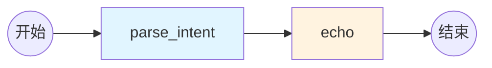

# M0: 项目脚手架与基线

::: tip 学习目标
通过本模块，你将学会：
- ✅ 理解NL2SQL系统的整体架构
- ✅ 掌握LangGraph的State和Graph设计
- ✅ 搭建可扩展的项目结构
- ✅ 实现灵活的配置管理系统
- ✅ 构建最小可运行的LangGraph程序
:::

## 模块概述

**M0模块** 是整个课程的基础，我们将构建一个**最小可运行**的LangGraph系统，为后续所有模块打下坚实的地基。

### 为什么需要脚手架？

想象一下，如果没有良好的项目结构：

❌ **混乱的代码组织**
```
my_project/
  main.py           # 所有代码都在一个文件？
  config.txt        # 配置格式不统一
  test.py           # 测试代码混在一起
```

❌ **重复的配置管理**
```python
# 文件1
openai_key = "sk-..."

# 文件2
openai_key = "sk-..."  # 重复配置

# 文件3
api_key = "sk-..."  # 字段名不一致
```

❌ **难以扩展**
```python
# 添加新功能要改动很多地方
# 测试困难
# 部署混乱
```

### M0要解决什么问题？

✅ **统一的项目结构**
- 代码按功能模块组织
- 配置、测试、文档分离
- 易于导航和维护

✅ **灵活的配置系统**
- 支持多个LLM提供商 (DeepSeek/Qwen/OpenAI)
- 环境变量 + 配置文件双重管理
- 易于切换开发/生产环境

✅ **可追踪的State设计**
- 明确的数据流
- 每个节点的输入输出清晰
- 便于调试和测试

✅ **简单的验收机制**
- 自动化测试
- 清晰的验收标准
- 快速验证系统正常

## 核心概念

### LangGraph 是什么？

**LangGraph** 是 LangChain 团队开发的状态图编排框架，特别适合构建复杂的 Agent 系统。

**为什么选择 LangGraph？**

传统的 Chain 方式：
```python
# LangChain的链式调用
chain = prompt | llm | output_parser
result = chain.invoke({"question": "..."})
```

问题：
- ❌ 流程固定，难以处理条件分支
- ❌ 无法实现循环（如重试机制）
- ❌ 状态管理困难
- ❌ 调试不便

LangGraph 的优势：
```python
# LangGraph的图式编排
workflow = StateGraph(MyState)
workflow.add_node("parse", parse_node)
workflow.add_node("generate", generate_node)
workflow.add_node("validate", validate_node)

# 支持条件跳转
workflow.add_conditional_edges(
    "validate",
    should_retry,
    {
        "retry": "generate",  # 失败重试
        "done": END          # 成功结束
    }
)
```

优势：
- ✅ 支持复杂的控制流（条件、循环）
- ✅ State 明确，易于调试
- ✅ 可视化流程
- ✅ 每个节点独立测试

### State 设计哲学

在 LangGraph 中，**State** 是核心概念。它就像一个在节点间传递的"包裹"：

```python
class NL2SQLState(TypedDict):
    # 用户输入
    question: str

    # 处理过程
    intent: Optional[Dict]

    # 元数据
    session_id: Optional[str]
    timestamp: Optional[str]
```

**State 设计原则**：

1. **明确性**：每个字段的含义清晰
2. **类型安全**：使用 TypedDict 定义类型
3. **渐进式**：M0 只定义基础字段，后续模块扩展
4. **可选性**：用 Optional 标记可能为空的字段

### 配置管理策略

我们采用 **环境变量 + 配置文件** 的双重管理：

**环境变量** (`.env`)：
- 敏感信息（API Key）
- 环境相关配置
- 高优先级

**配置文件** (`configs/dev.yaml`)：
- 结构化配置
- 业务逻辑参数
- 易于版本管理

```python
# 自动合并两者
config = Config()
llm_config = config.get_llm_config()
# 自动根据 LLM_PROVIDER 获取对应配置
```

## 项目结构

M0 模块搭建的项目结构：

```
rookie-nl2sql/
├── graphs/                    # LangGraph 核心代码
│   ├── __init__.py
│   ├── state.py              # State 定义
│   ├── base_graph.py         # 基础图实现
│   └── nodes/                # 节点实现（M1+）
│
├── configs/                   # 配置管理
│   ├── __init__.py
│   ├── config.py             # 配置加载器
│   └── dev.yaml              # 开发环境配置
│
├── tools/                     # 工具函数
│   ├── __init__.py
│   ├── db.py                 # 数据库工具（M2+）
│   └── retriever.py          # 向量检索（M6+）
│
├── prompts/                   # Prompt 模板
│   ├── nl2sql.txt            # SQL生成（M1+）
│   └── critique.txt          # SQL修复（M4+）
│
├── tests/                     # 测试代码
│   ├── test_m0_acceptance.py # M0 验收测试
│   └── ...
│
├── data/                      # 数据文件
│   ├── chinook.db            # 示例数据库（M2+）
│   └── rag_corpus/           # RAG 语料（M6+）
│
├── docs/                      # 课程文档
│   ├── guide/                # 指南文档
│   ├── modules/              # 模块文档
│   └── .vitepress/           # 文档配置
│
├── .env.example               # 环境变量模板
├── .gitignore
├── requirements.txt           # Python 依赖
├── README.md                  # 项目说明
└── LICENSE
```

**设计原则**：

1. **职责分离**：每个目录有明确的职责
2. **易于导航**：结构清晰，文件易找
3. **渐进式扩展**：M0 搭好骨架，后续模块填充内容
4. **测试驱动**：每个模块都有对应测试

## 核心实现

### State 定义

```python
# graphs/state.py
from typing import TypedDict, Optional, Dict, Any

class NL2SQLState(TypedDict):
    """
    NL2SQL系统的基础State

    M0: 只包含基础字段
    M1+: 逐步扩展更多字段
    """
    # 用户输入
    question: str

    # 意图解析 (M0)
    intent: Optional[Dict[str, Any]]

    # 元数据
    session_id: Optional[str]
    timestamp: Optional[str]
```

::: details 为什么使用 TypedDict？
- ✅ 类型提示，IDE 自动补全
- ✅ 运行时类型检查（配合 Pydantic）
- ✅ 文档作用，代码即文档
- ✅ 易于维护和重构
:::

### 基础 Graph

```python
# graphs/base_graph.py
from langgraph.graph import StateGraph, END

def parse_intent_node(state: NL2SQLState) -> NL2SQLState:
    """解析用户意图"""
    question = state.get("question", "")

    # M0: 简单的意图识别
    intent = {
        "type": "query",
        "question_length": len(question),
        "has_keywords": any(kw in question.lower()
                           for kw in ["查询", "统计", "多少"]),
        "parsed_at": datetime.now().isoformat()
    }

    return {**state, "intent": intent}

def echo_node(state: NL2SQLState) -> NL2SQLState:
    """回显节点，用于验证"""
    print(f"Question: {state.get('question')}")
    print(f"Intent: {state.get('intent')}")
    return state

# 构建图
workflow = StateGraph(NL2SQLState)
workflow.add_node("parse_intent", parse_intent_node)
workflow.add_node("echo", echo_node)

workflow.set_entry_point("parse_intent")
workflow.add_edge("parse_intent", "echo")
workflow.add_edge("echo", END)

graph = workflow.compile()
```

**流程图**：



### 配置系统

```python
# configs/config.py
class Config:
    def get_llm_config(self) -> Dict[str, Any]:
        """根据 provider 自动选择配置"""
        provider = self.get("llm_provider", "deepseek")

        if provider == "deepseek":
            return {
                "provider": "deepseek",
                "api_key": self.get("deepseek_api_key"),
                "model": self.get("deepseek_model"),
                "base_url": self.get("deepseek_base_url"),
                "temperature": self.get("llm_temperature"),
            }
        # ... qwen, openai 同理
```

**优势**：
- 统一接口，切换 LLM 只需改一行配置
- 环境变量优先级高于配置文件
- 支持默认值，开箱即用

## 验收标准

M0 模块的验收标准：**输入一句话，控制台能正确打印意图对象**

### 运行测试

```bash
# 方式1: 直接运行图
python graphs/base_graph.py

# 方式2: 运行验收测试
python tests/test_m0_acceptance.py
```

### 预期输出

```
==================================================
Starting NL2SQL Graph (M0 - Scaffold)
==================================================

=== Parse Intent Node ===
Question: 查询所有用户的订单数量
Intent: {
  "type": "query",
  "question_length": 11,
  "has_keywords": true,
  "parsed_at": "2024-01-15T10:30:00"
}

=== Echo Node ===
Session ID: 550e8400-e29b-41d4-a716-446655440000
Question: 查询所有用户的订单数量
Intent: {"type": "query", ...}
Timestamp: 2024-01-15T10:30:00.123456

Final State Keys: ['question', 'session_id', 'timestamp', 'intent']
Intent Parsed: ✓
```

## 快速开始

### 步骤 1: 切换分支

```bash
git checkout 00-scaffold
```

### 步骤 2: 安装依赖

```bash
# 创建虚拟环境
python -m venv venv
source venv/bin/activate  # Windows: venv\Scripts\activate

# 安装依赖
pip install -r requirements.txt
```

### 步骤 3: 配置环境（可选）

M0 阶段不需要 API Key，可以跳过此步骤。

```bash
cp .env.example .env
# 如需配置，编辑 .env 文件
```

### 步骤 4: 运行测试

```bash
# 测试配置加载
python configs/config.py

# 测试基础图
python graphs/base_graph.py

# 运行验收测试
python tests/test_m0_acceptance.py
```

### 预期结果

所有测试通过 ✓

## 关键设计决策

### 为什么使用 TypedDict 而不是 Pydantic？

**选择 TypedDict**：
- ✅ 轻量级，LangGraph 原生支持
- ✅ 类型提示即可，无需实例化
- ✅ 性能更好

**如需严格校验，可在节点内使用 Pydantic**：
```python
from pydantic import BaseModel

class IntentSchema(BaseModel):
    type: str
    question_length: int

def parse_intent_node(state):
    intent = IntentSchema(type="query", question_length=10)
    return {**state, "intent": intent.dict()}
```

### 为什么支持多个 LLM 提供商？

**原因**：
1. **国内用户友好**：DeepSeek/Qwen 无需科学上网
2. **成本控制**：价格差异大（DeepSeek: ¥1/M tokens vs GPT-4: $30/M tokens）
3. **灵活切换**：根据任务复杂度选择模型
4. **避免供应商锁定**：OpenAI API 兼容格式

### 为什么配置系统这么复杂？

**看似复杂，实则灵活**：

```python
# 使用时很简单
config = Config()
llm_config = config.get_llm_config()  # 自动选择 provider

# 切换 LLM 只需改一行
# .env: LLM_PROVIDER=qwen
```

**收益**：
- 一次配置，处处使用
- 环境隔离（dev/prod）
- 敏感信息保护
- 易于测试（Mock配置）

## 下一步

恭喜！你已经完成了 M0 模块。

现在你已经掌握了：
- ✅ LangGraph 的 State 和 Graph 设计
- ✅ 项目结构的组织方式
- ✅ 灵活的配置管理
- ✅ 验收测试的编写

**接下来**：
- 👉 [M0 项目结构详解](./project-structure.md)
- 👉 [M0 配置系统详解](./configuration.md)
- 👉 [M0 LangGraph 基础](./langgraph-basics.md)
- 👉 [M0 实践任务](./tasks.md)
- 👉 [M1: 提示词工程](/modules/m1/overview.md)
