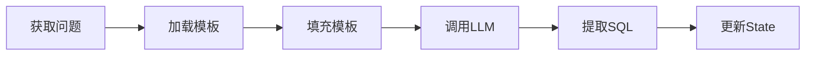

# M1: 提示词工程实现 NL2SQL

::: tip 学习目标
通过本模块，你将学会：
- ✅ 理解提示词工程在 NL2SQL 中的作用
- ✅ 掌握 Few-shot Learning 技术
- ✅ 设计高质量的 NL2SQL Prompt
- ✅ 封装统一的 LLM Client
- ✅ 实现 SQL 生成节点
:::

## 模块概述

**M1 模块** 是 NL2SQL 系统的核心功能实现，我们将使用**提示词工程**让 LLM 理解自然语言并生成对应的 SQL 查询。

### 为什么需要提示词工程？

想象一下，如果直接问 LLM："查询所有用户"，它可能给你这样的回答：

```
好的，我来帮你查询所有用户。你想查询哪个系统的用户？需要查询哪些字段？
```

这不是我们想要的！我们需要的是：

```sql
SELECT * FROM users;
```

**提示词工程就是告诉 LLM**：
- 你的角色是什么（SQL 专家）
- 输入是什么格式（自然语言问题）
- 输出是什么格式（SQL 语句）
- 如何生成正确的 SQL（Few-shot 示例）

### M1 要解决什么问题？

✅ **LLM 集成**
- 封装统一的 LLM Client
- 支持多个提供商（DeepSeek/Qwen/OpenAI）
- 简化 API 调用

✅ **Prompt 设计**
- 设计清晰的任务描述
- 提供 Few-shot 示例
- 明确输出格式要求

✅ **SQL 生成**
- 将自然语言转换为 SQL
- 处理多种问题类型
- 提取和格式化 SQL

✅ **图结构扩展**
- 在 M0 基础上添加 SQL 生成节点
- 更新 State 定义
- 保持流程清晰

## 核心概念

### 提示词工程是什么？

**提示词工程**（Prompt Engineering）是指设计和优化发送给 LLM 的提示文本，以获得期望的输出。

**类比**：
- 传统编程：写代码 → 编译器执行 → 得到结果
- 提示词工程：写 Prompt → LLM 理解 → 生成输出

**好的 Prompt vs 坏的 Prompt**：

<table>
<tr>
<th>❌ 坏的 Prompt</th>
<th>✅ 好的 Prompt</th>
</tr>
<tr>
<td>

```
把这句话转成SQL: 查询所有用户
```

</td>
<td>

```
你是一个SQL专家。

## 任务
将自然语言问题转换为SQL查询。

## 数据库Schema
users (id, name, email, city)

## 示例
问题: 查询所有客户
SQL: SELECT * FROM customers;

## 要求
- 只返回SQL，不要解释
- 使用标准SQL语法

## 用户问题
查询所有用户

## SQL查询
```

</td>
</tr>
</table>

### Few-shot Learning

**Few-shot Learning** 是在 Prompt 中提供少量示例，帮助 LLM 理解任务。

**为什么需要 Few-shot？**

| 方法 | 效果 | 说明 |
|------|------|------|
| **Zero-shot** | 😐 | 只有任务描述，无示例<br/>LLM 需要自己理解 |
| **Few-shot** | 😊 | 提供 3-5 个示例<br/>LLM 通过示例学习模式 |
| **Many-shot** | 🤔 | 提供大量示例<br/>可能超出 token 限制 |

**M1 使用的 5 个 Few-shot 示例**：

1. **简单查询**：`SELECT * FROM customers;`
2. **条件查询**：`WHERE city = '北京'`
3. **聚合查询**：`COUNT(*) ... GROUP BY`
4. **排序查询**：`ORDER BY ... DESC LIMIT 10`
5. **JOIN 查询**：`LEFT JOIN ... ON`

这 5 个示例覆盖了大部分常见的 SQL 模式。

### LLM Client 设计

为了方便使用不同的 LLM，我们封装了统一的 `LLMClient`：

```python
from tools.llm_client import llm_client

# 简单调用
response = llm_client.chat(
    prompt="将这句话翻译成SQL: 查询所有用户",
    system_message="你是一个SQL专家"
)
```

**优势**：
- ✅ 统一接口，切换模型只需改配置
- ✅ 自动读取 API Key 和参数
- ✅ 支持 DeepSeek/Qwen/OpenAI

**底层实现**：
```python
class LLMClient:
    def __init__(self):
        llm_config = config.get_llm_config()  # 读取配置
        self.client = ChatOpenAI(            # 使用 LangChain
            model=llm_config["model"],
            api_key=llm_config["api_key"],
            base_url=llm_config["base_url"],
            ...
        )
```

## 项目结构变化

M1 在 M0 基础上新增了以下文件：

```
rookie-nl2sql/
├── graphs/
│   ├── state.py           # ✨ 新增 candidate_sql 字段
│   ├── base_graph.py      # ✨ 添加 generate_sql 节点
│   └── nodes/
│       ├── __init__.py    # 🆕 新增
│       └── generate_sql.py # 🆕 SQL 生成节点
├── tools/
│   └── llm_client.py      # 🆕 LLM 客户端封装
├── prompts/
│   └── nl2sql.txt         # 🆕 NL2SQL Prompt 模板
├── tests/
│   └── test_m1_acceptance.py # 🆕 M1 验收测试
```

**关键变化**：

1. **State 扩展** (`graphs/state.py`):
   ```python
   candidate_sql: Optional[str]        # 生成的 SQL
   sql_generated_at: Optional[str]     # 生成时间
   ```

2. **新增节点** (`graphs/nodes/generate_sql.py`):
   - 加载 Prompt 模板
   - 调用 LLM 生成 SQL
   - 提取和格式化 SQL

3. **图结构更新** (`graphs/base_graph.py`):
   ```
   parse_intent → generate_sql → echo → END
   ```

## 核心实现

### 1. Prompt 模板

文件: `prompts/nl2sql.txt`

```
你是一个SQL专家，擅长将自然语言问题转换为SQL查询。

## 任务
根据用户的自然语言问题，生成对应的SQL查询语句。

## 数据库Schema
{schema}

## Few-Shot 示例

### 示例 1: 简单查询
问题: 查询所有客户
SQL:
```sql
SELECT * FROM customers;
```

[... 更多示例 ...]

## 要求
1. 只返回SQL语句，不要有任何解释
2. 使用标准SQL语法
3. 确保列名和表名与Schema一致

## 用户问题
{question}

## SQL查询
```

**设计要点**：
- 角色定义：SQL 专家
- 任务描述：清晰明确
- Schema 占位符：M3 会填入真实 Schema
- Few-shot 示例：5 个典型场景
- 输出要求：只要 SQL，不要解释

### 2. LLM Client

文件: `tools/llm_client.py`

```python
class LLMClient:
    def chat(self, prompt: str, system_message: str = None) -> str:
        """发送消息并获取回复"""
        messages = []
        if system_message:
            messages.append(SystemMessage(content=system_message))
        messages.append(HumanMessage(content=prompt))

        response = self.client.invoke(messages)
        return response.content
```

**特点**：
- 简洁的 API
- 自动配置管理
- 支持 system message

### 3. SQL 生成节点

文件: `graphs/nodes/generate_sql.py`

```python
def generate_sql_node(state: NL2SQLState) -> NL2SQLState:
    # 1. 加载 Prompt 模板
    template = load_prompt_template("nl2sql")

    # 2. 填充模板
    prompt = template.format(
        schema=schema_placeholder,
        question=state["question"]
    )

    # 3. 调用 LLM
    response = llm_client.chat(prompt)

    # 4. 提取 SQL
    sql = extract_sql_from_response(response)

    # 5. 更新 State
    return {**state, "candidate_sql": sql}
```

**流程**：


## 验收标准

M1 模块的验收标准：**10条单表查询的 Exact Match ≥ 70%**

### 测试用例

```python
test_cases = [
    "查询所有客户",
    "查询来自北京的客户",
    "统计每个城市的客户数量",
    "查询销售额最高的前10个客户",
    "统计总订单数",
    "查询订单金额大于1000的订单",
    "查询产品价格",
    "按价格降序排列产品",
    "统计每个分类的产品数量",
    "查询价格在100到500之间的产品"
]
```

### 运行测试

```bash
# 确保已配置 API Key
python tests/test_m1_acceptance.py
```

**预期输出**：
```
通过: 7/10
失败: 3/10
通过率: 70.0%

🎉 恭喜! M1 验收测试通过!
```

::: warning 注意
M1 阶段没有真实的数据库 Schema，LLM 需要猜测表名和列名，因此可能与预期不完全一致。这是正常的，M3 引入 Schema 后会显著改善。
:::

## 快速开始

### 步骤 1: 切换分支

```bash
git checkout 01-prompt-nl2sql
```

### 步骤 2: 配置 API Key

```bash
# 复制模板
cp .env.example .env

# 编辑 .env 文件
LLM_PROVIDER=deepseek
DEEPSEEK_API_KEY=sk-xxxxxxxx
```

### 步骤 3: 测试运行

```bash
# 测试 LLM Client
python tools/llm_client.py

# 测试 SQL 生成
python graphs/nodes/generate_sql.py

# 运行完整图
python graphs/base_graph.py

# 运行验收测试
python tests/test_m1_acceptance.py
```

## 关键技术点

### 1. Prompt 模板化

**为什么要模板化？**
- ✅ 易于维护和调优
- ✅ 支持 A/B 测试
- ✅ 非代码人员也能优化

**如何使用？**
```python
template = load_prompt_template("nl2sql")  # 从文件加载
prompt = template.format(                   # 填充变量
    schema=schema,
    question=question
)
```

### 2. SQL 提取

LLM 的响应可能有多种格式：

```python
# 格式 1: 带 markdown 代码块
'''sql
SELECT * FROM users;
'''

# 格式 2: 纯 SQL
SELECT * FROM users;

# 格式 3: 带解释
这是一个查询所有用户的 SQL:
SELECT * FROM users;
```

`extract_sql_from_response()` 函数处理所有这些情况。

### 3. 错误处理

```python
try:
    response = llm_client.chat(prompt)
    sql = extract_sql_from_response(response)
except Exception as e:
    print(f"✗ Error: {e}")
    return {**state, "candidate_sql": None}
```

## 限制与改进

### 当前限制

- ❌ **没有 Schema**：M3 会解决
- ❌ **没有校验**：M4 会添加
- ❌ **不能执行**：M2 会实现
- ❌ **不理解黑话**：M6 用 RAG 解决

### 改进方向

**短期**（M2-M4）：
- 添加数据库执行
- 注入真实 Schema
- SQL 校验和修复

**中期**（M5-M8）：
- 安全沙箱
- RAG 增强
- 多轮对话
- 复杂 JOIN

## 常见问题

### Q: 为什么生成的 SQL 不准确？

A: M1 阶段常见原因：
1. **没有真实 Schema** → LLM 在猜测表名/列名
2. **Few-shot 不足** → 可以添加更多示例
3. **模型能力有限** → 尝试更强大的模型（qwen-max, gpt-4）

M3 引入 Schema 后会显著改善。

### Q: 如何优化 Prompt？

A: 优化技巧：
1. **明确任务**：告诉 LLM 要做什么
2. **提供示例**：Few-shot 非常重要
3. **限制输出**：明确输出格式
4. **迭代测试**：不断调整优化

### Q: 支持哪些 LLM？

A: 当前支持：
- **DeepSeek**（推荐）: deepseek-chat
- **Qwen**: qwen-turbo, qwen-plus, qwen-max
- **OpenAI**: gpt-3.5-turbo, gpt-4

切换只需修改 `.env` 文件。

### Q: 测试失败率高怎么办？

A: 排查步骤：
1. 检查 API Key 是否正确
2. 查看 LLM 原始响应（日志中有）
3. 尝试更强大的模型
4. 优化 Prompt 模板
5. **等待 M3**：Schema 会大幅提升质量

## 下一步

恭喜完成 M1 模块！现在你已经掌握了：
- ✅ 提示词工程基础
- ✅ Few-shot Learning 技术
- ✅ LLM Client 封装
- ✅ SQL 生成实现

**接下来**：
- 👉 [M1 提示词工程详解](./prompt-engineering.md)
- 👉 [M1 LLM Client 设计](./llm-client.md)
- 👉 [M1 实践任务](./tasks.md)
- 👉 [M2: Function Call 数据库操作](/modules/m2/overview.md)
