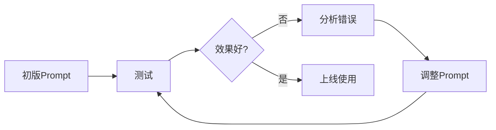

# 提示词工程详解

本文深入讲解 M1 模块中的提示词工程技术，帮助你设计出高质量的 NL2SQL Prompt。

## 什么是提示词工程

### 定义

**提示词工程**（Prompt Engineering）是指设计和优化发送给大语言模型（LLM）的输入文本，以获得期望的输出结果。

### 为什么重要

在 NL2SQL 系统中，Prompt 的质量直接决定了：
- SQL 生成的准确率
- 系统的稳定性
- 用户体验

一个好的 Prompt 可以让 70B 的模型超越差 Prompt 下的 175B 模型！

## Prompt 设计原则

### 1. 明确角色（Role）

告诉 LLM 它是谁，它应该以什么身份回答。

**示例**：
```
你是一个SQL专家，擅长将自然语言问题转换为SQL查询。
```

**为什么有效？**
- 设定上下文和期望
- 激活 LLM 的相关知识
- 减少不相关的输出

### 2. 清晰的任务描述（Task）

用简洁明确的语言描述要完成的任务。

**好的任务描述**：
```
## 任务
根据用户的自然语言问题，生成对应的SQL查询语句。
```

**坏的任务描述**：
```
帮我处理一下用户的问题
```

### 3. 提供上下文（Context）

给出 LLM 完成任务所需的背景信息。

**对于 NL2SQL**：
```
## 数据库Schema
users (user_id, name, email, city, created_at)
orders (order_id, user_id, amount, order_date)
products (product_id, name, price, category)
```

**为什么重要？**
- LLM 需要知道有哪些表和字段
- 减少"幻觉"（生成不存在的表名）
- 提高 SQL 的准确性

### 4. Few-shot 示例（Examples）

提供少量输入-输出示例，帮助 LLM 理解模式。

**结构**：
```
### 示例 1: [类型描述]
问题: [自然语言问题]
SQL:
```sql
[对应的SQL]
```
```

**M1 的 5 个示例**：

| 序号 | 类型 | 作用 |
|------|------|------|
| 1 | 简单查询 | 教会 SELECT * |
| 2 | 条件查询 | 教会 WHERE |
| 3 | 聚合查询 | 教会 GROUP BY + COUNT |
| 4 | 排序查询 | 教会 ORDER BY + LIMIT |
| 5 | JOIN 查询 | 教会多表关联 |

### 5. 明确输出格式（Format）

告诉 LLM 输出什么格式，不要输出什么。

**要求**：
```
## 要求
1. 只返回SQL语句，不要有任何解释或说明
2. 使用标准SQL语法
3. 确保列名和表名与Schema完全一致
4. 如果需要聚合，使用GROUP BY
5. 如果需要排序，使用ORDER BY
6. 如果需要限制数量，使用LIMIT
7. SQL语句必须以分号结尾
```

**为什么详细列出？**
- 减少 LLM 的随意性
- 确保输出可解析
- 提高一致性

### 6. 结构化输入（Structure）

使用标题、分隔符等让 Prompt 结构清晰。

**好的结构**：
```
你是一个SQL专家。

## 任务
...

## 数据库Schema
...

## Few-Shot 示例
...

## 要求
...

## 用户问题
...

## SQL查询
```

**坏的结构**：
```
你是SQL专家，根据用户问题生成SQL，数据库有users表，示例如下...
```

## M1 的 Prompt 解析

让我们逐段分析 `prompts/nl2sql.txt`：

### 第1部分：角色定义

```
你是一个SQL专家，擅长将自然语言问题转换为SQL查询。
```

**作用**：
- 设定 LLM 的角色
- 明确专业领域

### 第2部分：任务描述

```
## 任务
根据用户的自然语言问题，生成对应的SQL查询语句。
```

**作用**：
- 一句话说明要做什么
- 简洁明了

### 第3部分：Schema（M3 会填充）

```
## 数据库Schema
{schema}
```

**M1 阶段**：
```
示例表结构 (M1阶段占位, M3将使用真实Schema):
- customers (customer_id, customer_name, city, country)
- orders (order_id, customer_id, amount, order_date)
- products (product_id, product_name, price, category)
```

**M3 阶段**（真实 Schema）：
```
## 数据库Schema

### 表: users
- user_id (INT, PRIMARY KEY)
- name (VARCHAR(100))
- email (VARCHAR(255))
- city (VARCHAR(50))

### 表: orders
- order_id (INT, PRIMARY KEY)
- user_id (INT, FOREIGN KEY -> users.user_id)
- amount (DECIMAL(10,2))
- order_date (DATE)
```

### 第4部分：Few-shot 示例

#### 示例 1: 简单查询
```
### 示例 1: 简单查询
问题: 查询所有客户
SQL:
```sql
SELECT * FROM customers;
```
```

**教会**：基础 SELECT 语法

#### 示例 2: 条件查询
```
### 示例 2: 条件查询
问题: 查询来自北京的客户
SQL:
```sql
SELECT * FROM customers WHERE city = '北京';
```
```

**教会**：WHERE 条件过滤

#### 示例 3: 聚合查询
```
### 示例 3: 聚合查询
问题: 统计每个城市的客户数量
SQL:
```sql
SELECT city, COUNT(*) as customer_count
FROM customers
GROUP BY city;
```
```

**教会**：GROUP BY + COUNT

#### 示例 4: 排序查询
```
### 示例 4: 排序查询
问题: 查询销售额最高的前10个客户
SQL:
```sql
SELECT customer_name, SUM(amount) as total_sales
FROM orders
GROUP BY customer_name
ORDER BY total_sales DESC
LIMIT 10;
```
```

**教会**：ORDER BY + LIMIT

#### 示例 5: JOIN 查询
```
### 示例 5: JOIN查询
问题: 查询每个客户的订单数量
SQL:
```sql
SELECT c.customer_name, COUNT(o.order_id) as order_count
FROM customers c
LEFT JOIN orders o ON c.customer_id = o.customer_id
GROUP BY c.customer_name;
```
```

**教会**：表别名 + JOIN

### 第5部分：输出要求

```
## 要求
1. **只返回SQL语句**，不要有任何解释或说明
2. 使用标准SQL语法
3. 确保列名和表名与Schema完全一致
4. 如果需要聚合，使用GROUP BY
5. 如果需要排序，使用ORDER BY
6. 如果需要限制数量，使用LIMIT
7. SQL语句必须以分号结尾
```

**作用**：
- 减少无关输出
- 标准化 SQL 格式
- 便于后续解析

### 第6部分：用户输入

```
## 用户问题
{question}

## SQL查询
```

**作用**：
- 明确指定用户问题的位置
- `## SQL查询` 作为输出的提示

## Few-shot 设计技巧

### 选择示例的原则

1. **覆盖典型场景**
   - 增删改查（CRUD）
   - 聚合统计
   - 排序过滤
   - 多表关联

2. **由简到难**
   - 从简单的 SELECT * 开始
   - 逐步引入 WHERE, GROUP BY, JOIN

3. **数量适中**
   - 太少（1-2个）：LLM 学不会
   - 太多（>10个）：token 浪费，可能混淆
   - **建议：3-5个**

4. **真实性**
   - 使用实际业务场景
   - 问题表述自然
   - SQL 正确可执行

### 示例的格式一致性

**保持一致**：
```
### 示例 1: 简单查询
问题: 查询所有客户
SQL:
```sql
SELECT * FROM customers;
```

### 示例 2: 条件查询
问题: 查询来自北京的客户
SQL:
```sql
SELECT * FROM customers WHERE city = '北京';
```
```

**不要这样**：
```
示例1：查询所有客户
SELECT * FROM customers;

问题2：查询来自北京的客户
sql: SELECT * FROM customers WHERE city = '北京'
```

## Prompt 优化技巧

### 1. 迭代优化



**流程**：
1. 写初版 Prompt
2. 在测试集上运行
3. 分析失败案例
4. 调整 Prompt
5. 重复 2-4

### 2. A/B 测试

准备多个版本的 Prompt，对比效果：

```python
# 版本 A: 简洁版
prompts/nl2sql_v1.txt

# 版本 B: 详细版
prompts/nl2sql_v2.txt

# 对比测试
for prompt_version in ["v1", "v2"]:
    accuracy = test_prompt(prompt_version)
    print(f"{prompt_version}: {accuracy}")
```

### 3. 动态示例选择

根据问题类型选择相关示例：

```python
def get_relevant_examples(question):
    if "统计" in question or "多少" in question:
        return aggregation_examples  # 聚合示例
    elif "排序" in question or "最" in question:
        return ranking_examples      # 排序示例
    else:
        return basic_examples        # 基础示例
```

### 4. 添加负面示例

告诉 LLM 什么是**错误的**：

```
## 错误示例

### ❌ 错误做法
问题: 查询所有用户
SQL: 这是一个查询所有用户的SQL语句：SELECT * FROM users;

原因: 包含了解释文字，应该只返回SQL

### ✅ 正确做法
问题: 查询所有用户
SQL: SELECT * FROM users;
```

## 常见陷阱

### 陷阱 1: 过于简洁

**问题**：
```
把这句话转成SQL: 查询所有用户
```

**结果**：LLM 可能返回解释、伪代码，甚至其他语言的代码。

**解决**：明确任务、格式、要求。

### 陷阱 2: 示例太少

**问题**：
```
### 示例
问题: 查询所有客户
SQL: SELECT * FROM customers;

## 用户问题
统计每个城市的客户数量
```

**结果**：LLM 可能生成：`SELECT city FROM customers;`

**解决**：添加 GROUP BY 的示例。

### 陷阱 3: 格式不一致

**问题**：
```
示例1：SELECT * FROM customers
示例2:
```sql
SELECT * FROM customers WHERE city = '北京';
```
```

**结果**：LLM 混淆，输出格式不稳定。

**解决**：统一格式。

### 陷阱 4: 过度复杂

**问题**：Prompt 包含 20 个示例，3000+ tokens

**结果**：
- 成本高
- 响应慢
- 可能超出 token 限制

**解决**：精选 3-5 个代表性示例。

## 评估 Prompt 质量

### 定量指标

| 指标 | 计算方法 | 目标 |
|------|----------|------|
| **Exact Match** | 生成SQL == 标准答案 | ≥70% |
| **Execution Accuracy** | 执行结果正确 | ≥80% |
| **平均Token数** | avg(len(response)) | 越少越好 |
| **响应时间** | avg(latency) | <2s |

### 定性分析

**好的 Prompt 特征**：
- ✅ 输出格式稳定
- ✅ 很少出现无关内容
- ✅ SQL 语法正确
- ✅ 能处理边界情况

**差的 Prompt 特征**：
- ❌ 输出包含解释
- ❌ 经常生成错误SQL
- ❌ 无法处理复杂问题
- ❌ 对问题表述敏感

## 实践建议

### 1. 从简单开始

**第一版**：
```
你是SQL专家。把这句话转成SQL: {question}
```

**测试 → 发现问题 → 迭代**

### 2. 记录失败案例

```python
# failures.json
{
    "question": "查询北京和上海的用户",
    "expected": "SELECT * FROM users WHERE city IN ('北京', '上海');",
    "got": "SELECT * FROM users WHERE city = '北京' OR city = '上海';",
    "reason": "IN 语法未教会"
}
```

### 3. 针对性优化

发现 IN 语法问题 → 添加相关示例：
```
### 示例: 多值查询
问题: 查询北京和上海的用户
SQL:
```sql
SELECT * FROM users WHERE city IN ('北京', '上海');
```
```

### 4. 版本管理

```
prompts/
├── nl2sql_v1.txt  # 初版
├── nl2sql_v2.txt  # 添加IN示例
├── nl2sql_v3.txt  # 优化输出格式
└── nl2sql.txt     # 当前版本（软链接）
```

## 下一步

- 👉 [LLM Client 设计](./llm-client.md)
- 👉 [M1 实践任务](./tasks.md)
- 👉 [返回 M1 概述](./overview.md)
