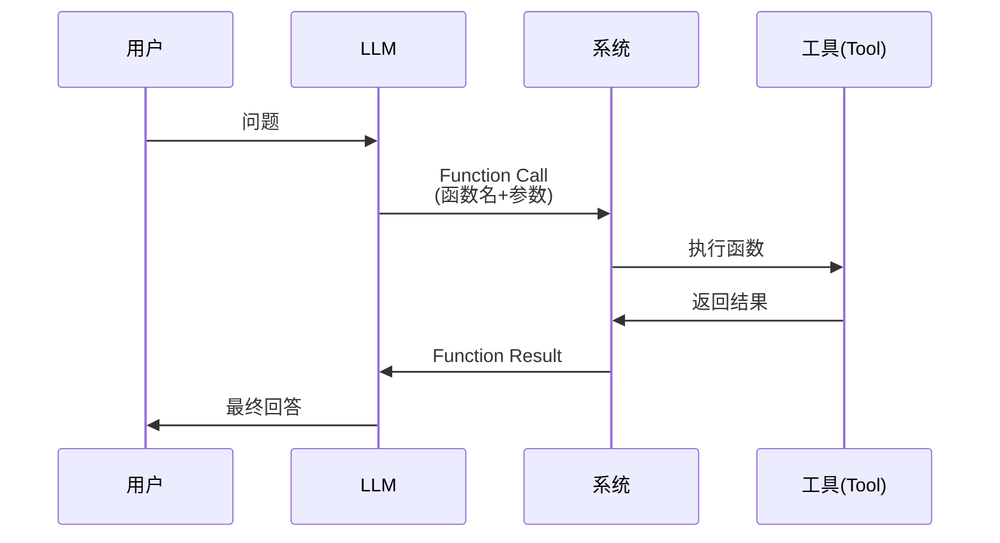

# Function Call 详解

本文深入讲解 M2 模块中的 Function Call 技术，帮助你理解 LLM Agent 如何使用工具。

## 什么是 Function Call？

### 定义

**Function Call** (也称 Tool Use、Tool Calling) 是让 LLM 能够调用外部函数/工具的技术。

**核心思想**：
- LLM 不直接执行操作
- LLM 生成调用指令
- 系统执行实际操作
- 结果返回给 LLM

### 为什么需要 Function Call？

**LLM 的局限**：
- ❌ 不能访问实时数据
- ❌ 不能执行代码
- ❌ 不能操作外部系统
- ❌ 知识有截止日期

**Function Call 的能力**：
- ✅ 查询数据库
- ✅ 调用 API
- ✅ 执行计算
- ✅ 访问文件系统

## Function Call 的工作原理

### 基本流程



### 详细步骤

1. **用户提问**
   ```
   用户: "Chinook 数据库里有多少客户？"
   ```

2. **LLM 决策**
   ```
   LLM 思考: 需要查询数据库
   决定调用: query_database()
   ```

3. **生成调用**
   ```json
   {
     "function": "query_database",
     "arguments": {
       "sql": "SELECT COUNT(*) FROM Customer"
     }
   }
   ```

4. **系统执行**
   ```python
   result = db_client.query("SELECT COUNT(*) FROM Customer")
   # {"ok": true, "rows": [{"COUNT(*)": 59}]}
   ```

5. **LLM 解释**
   ```
   LLM: "数据库中有 59 个客户。"
   ```

## M2 中的 Function Call 实现

### 实现方式

M2 使用了 **隐式 Function Call**：
- LLM 生成 SQL（不是显式的 function call 格式）
- 系统自动执行 SQL
- 结果存入 State

**流程**：
```python
# 1. LLM 生成 SQL (M1)
candidate_sql = "SELECT * FROM Album"

# 2. 系统执行 (M2)
result = db_client.query(candidate_sql)

# 3. 存入 State
state["execution_result"] = result
```

### 为什么不用显式 Function Call？

**显式方式**（标准 Function Call）：
```json
{
  "function": "query_database",
  "arguments": {"sql": "SELECT * FROM Album"}
}
```

**隐式方式**（M2 采用）：
```
直接生成: SELECT * FROM Album
```

**M2 选择隐式的原因**：
1. **简单**：不需要 LLM 学习 function schema
2. **稳定**：SQL 就是标准格式
3. **灵活**：后续可以轻松切换到显式

**后续模块会引入显式 Function Call**（如 M4 的 SQL 修复）。

## Function Call 的类型

### 1. 单步 Function Call

一次调用完成任务。

**示例**：
```
用户: 查询所有专辑
LLM: SELECT * FROM Album
系统: 执行 → 返回结果
```

**M2 使用的就是这种方式。**

### 2. 多步 Function Call

需要多次调用。

**示例**：
```
用户: AC/DC 有哪些专辑？

步骤1: 查询艺术家 ID
  SQL: SELECT ArtistId FROM Artist WHERE Name = 'AC/DC'
  结果: ArtistId = 1

步骤2: 查询专辑
  SQL: SELECT * FROM Album WHERE ArtistId = 1
  结果: [...专辑列表]
```

**M7 (多轮对话) 会实现这种方式。**

### 3. 并行 Function Call

同时调用多个工具。

**示例**：
```
用户: 对比 AC/DC 和 Metallica 的专辑数量

并行执行:
  Query 1: SELECT COUNT(*) FROM Album WHERE ArtistId = 1
  Query 2: SELECT COUNT(*) FROM Album WHERE ArtistId = 2

同时返回:
  AC/DC: 18 张
  Metallica: 10 张
```

**M8 (多表联结) 可能会用到。**

### 4. 条件 Function Call

根据条件决定是否调用。

**示例**：
```
用户: 如果 AC/DC 的专辑超过 10 张，列出前 5 张

Step 1: 检查数量
  IF count > 10: 执行查询
  ELSE: 返回所有
```

## Function Call 的设计模式

### 模式 1: Tool Registry (工具注册表)

集中管理所有可用工具。

```python
TOOLS = {
    "query_database": {
        "function": db_client.query,
        "description": "Execute SQL query",
        "parameters": {
            "sql": {"type": "string", "description": "SQL query"}
        }
    },
    "get_schema": {
        "function": db_client.get_table_schema,
        "description": "Get table schema",
        "parameters": {
            "table_name": {"type": "string"}
        }
    }
}
```

**优点**：
- 统一管理
- 便于扩展
- 自动生成文档

**M3-M4 会采用这种方式。**

### 模式 2: Node-based Execution (节点式执行)

每个工具是一个节点。

```python
# M2 的方式
workflow.add_node("execute_sql", execute_sql_node)
```

**优点**：
- 清晰的流程
- 易于调试
- 符合 LangGraph 理念

**M2 采用的就是这种方式。**

### 模式 3: Dynamic Function Call (动态调用)

LLM 决定调用哪个工具。

```python
tools = [db_tool, api_tool, file_tool]

# LLM 从 tools 中选择
chosen_tool = llm.choose_tool(question, tools)
result = chosen_tool.execute()
```

**优点**：
- 灵活
- 自主性强
- 可组合

**M6 (RAG) 和 M7 (多轮对话) 会用到。**

## 在 LangGraph 中实现 Function Call

### 方式 1: 作为节点

**M2 的实现**：

```python
def execute_sql_node(state: NL2SQLState) -> NL2SQLState:
    sql = state.get("candidate_sql")
    result = db_client.query(sql)
    return {**state, "execution_result": result}

# 添加到图中
workflow.add_node("execute_sql", execute_sql_node)
```

**优点**：
- 简单直观
- 易于测试
- 流程清晰

### 方式 2: 使用 LangChain Tools

```python
from langchain.tools import Tool

query_tool = Tool(
    name="query_database",
    func=db_client.query,
    description="Execute SQL query on the database"
)

# 在 LLM 调用中使用
llm_with_tools = llm.bind_tools([query_tool])
```

**优点**：
- 标准化
- 自动 schema 生成
- 与 LangChain 生态集成

**M4 开始会使用这种方式。**

### 方式 3: 条件边 (Conditional Edges)

根据结果决定下一步。

```python
def should_execute(state):
    if state.get("candidate_sql"):
        return "execute_sql"
    else:
        return "regenerate"

workflow.add_conditional_edges(
    "generate_sql",
    should_execute,
    {
        "execute_sql": "execute_sql",
        "regenerate": "generate_sql"
    }
)
```

**M4 (SQL 校验) 会用到。**

## Function Call 的最佳实践

### 1. 明确输入输出

**好的设计**：
```python
def query_database(sql: str) -> Dict[str, Any]:
    """
    Execute SQL query.

    Args:
        sql: SQL query string (SELECT only)

    Returns:
        {
            "ok": bool,
            "rows": list,
            "columns": list,
            "error": str
        }
    """
```

**坏的设计**：
```python
def query(s):
    return stuff  # 不清楚返回什么
```

### 2. 错误处理

**三层防护**：

```python
# 层1: 工具层
def query(sql):
    try:
        # 执行查询
    except DatabaseError as e:
        return {"ok": False, "error": str(e)}

# 层2: 节点层
def execute_sql_node(state):
    try:
        result = db_client.query(sql)
    except Exception as e:
        result = {"ok": False, "error": str(e)}
    return {**state, "execution_result": result}

# 层3: 应用层
if not result["ok"]:
    handle_error(result["error"])
```

### 3. 安全限制

**数据库查询安全**：

```python
def query(sql: str):
    # 1. 只读检查
    if not sql.strip().upper().startswith("SELECT"):
        raise SecurityError("Only SELECT allowed")

    # 2. 行数限制
    rows = cursor.fetchmany(100)

    # 3. 超时控制 (M5 会添加)
    cursor.execute(sql, timeout=10)

    # 4. 参数化查询
    cursor.execute(sql, params)  # 防 SQL 注入
```

### 4. 结果格式化

**统一结构**：

```python
# 所有 function 都返回相同格式
{
    "ok": bool,         # 是否成功
    "result": Any,      # 实际结果
    "error": str,       # 错误信息
    "metadata": dict    # 元数据
}
```

**好处**：
- 便于错误处理
- 便于日志记录
- 便于传递给下一个节点

### 5. 工具描述

**清晰的描述**：

```python
query_tool = Tool(
    name="query_database",
    description="""
    Execute a SQL SELECT query on the Chinook database.

    The database contains music store data with tables:
    - Artist, Album, Track, Genre
    - Customer, Invoice, InvoiceLine
    - Employee, Playlist, PlaylistTrack, MediaType

    Only SELECT queries are allowed. Results limited to 100 rows.

    Example usage:
    - "SELECT * FROM Album LIMIT 10"
    - "SELECT COUNT(*) FROM Customer"
    """,
    func=db_client.query
)
```

**LLM 会根据描述决定是否使用该工具。**

## Function Call 的调试技巧

### 1. 日志记录

```python
def execute_sql_node(state):
    sql = state.get("candidate_sql")

    print(f"[EXECUTE] SQL: {sql}")  # 记录输入

    result = db_client.query(sql)

    print(f"[EXECUTE] Result: ok={result['ok']}, rows={result['row_count']}")

    return {**state, "execution_result": result}
```

### 2. 单独测试工具

```python
# 不要直接在图中测试
# 先单独测试工具

from tools.db import db_client

# 测试 1: 正常查询
result = db_client.query("SELECT * FROM Album LIMIT 5")
assert result["ok"]
assert result["row_count"] == 5

# 测试 2: 错误查询
result = db_client.query("SELECT * FROM NonExistent")
assert not result["ok"]
assert "no such table" in result["error"]
```

### 3. Mock 测试

```python
# 在测试中 mock 数据库调用
from unittest.mock import patch

@patch('tools.db.db_client.query')
def test_execute_sql_node(mock_query):
    # 设置 mock 返回值
    mock_query.return_value = {
        "ok": True,
        "rows": [{"id": 1}],
        "row_count": 1
    }

    # 测试节点
    state = {"candidate_sql": "SELECT * FROM Album"}
    result = execute_sql_node(state)

    # 验证
    assert result["execution_result"]["ok"]
    mock_query.assert_called_once()
```

### 4. State 追踪

```python
# 在每个节点后打印 State
def execute_sql_node(state):
    print(f"\n=== BEFORE execute_sql ===")
    print(f"candidate_sql: {state.get('candidate_sql')}")

    result = db_client.query(state["candidate_sql"])

    new_state = {**state, "execution_result": result}

    print(f"\n=== AFTER execute_sql ===")
    print(f"execution_result.ok: {result.get('ok')}")
    print(f"execution_result.rows: {result.get('row_count')}")

    return new_state
```

## 常见陷阱

### 陷阱 1: 忘记错误处理

**问题**：
```python
def execute_sql_node(state):
    sql = state["candidate_sql"]  # 如果不存在会崩溃
    result = db_client.query(sql)  # 如果失败会崩溃
    return {**state, "execution_result": result}
```

**解决**：
```python
def execute_sql_node(state):
    sql = state.get("candidate_sql")
    if not sql:
        return {
            **state,
            "execution_result": {"ok": False, "error": "No SQL"}
        }

    try:
        result = db_client.query(sql)
    except Exception as e:
        result = {"ok": False, "error": str(e)}

    return {**state, "execution_result": result}
```

### 陷阱 2: 结果格式不一致

**问题**：
```python
# 有时返回字典
result = {"ok": True, "rows": [...]}

# 有时返回列表
result = [...]

# 有时返回 None
result = None
```

**解决**：统一格式
```python
# 总是返回相同结构
{
    "ok": bool,
    "rows": list,
    "error": str
}
```

### 陷阱 3: 无限循环

**问题**：
```python
# 如果 SQL 一直失败，一直重试
while not result["ok"]:
    result = retry_query()
```

**解决**：限制重试次数
```python
MAX_RETRIES = 3
for attempt in range(MAX_RETRIES):
    result = try_query()
    if result["ok"]:
        break
```

## 下一步

- 👉 [数据库工具设计](./database-tools.md)
- 👉 [M2 实践任务](./tasks.md)
- 👉 [返回 M2 概述](./overview.md)
