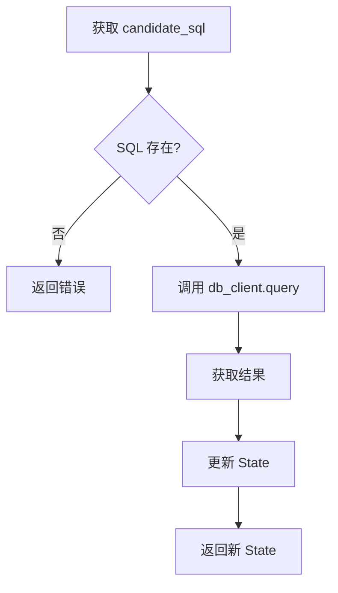

# M2: Function Call 实现数据库查询

::: tip 学习目标
通过本模块，你将学会：
- ✅ 理解 Function Call 在 Agent 中的作用
- ✅ 设计和实现数据库工具
- ✅ 将 SQL 查询集成到 LangGraph
- ✅ 处理执行结果和错误
- ✅ 实现安全的只读数据库访问
:::

## 模块概述

**M2 模块**在 M1 的基础上，让生成的 SQL 真正在数据库上执行并返回结果。这是从"生成代码"到"执行代码"的关键一步。

### 为什么需要 Function Call？

在 M1 中，我们让 LLM 生成了 SQL，但这些 SQL 只是文本，并没有实际执行。用户问"有多少客户？"，系统只能回答 SQL 是什么，而不能给出具体数字。

**M1 的局限**：
```
用户: 有多少客户？
M1: SELECT COUNT(*) FROM customers;
用户: ...那到底有多少？
```

**M2 的能力**：
```
用户: 有多少客户？
M2: 59 个客户
    (内部执行了 SELECT COUNT(*) FROM Customer)
```

这就是 **Function Call** (也称 Tool Use) 的价值：让 LLM 不仅能"说"，还能"做"。

### M2 要解决什么问题？

✅ **数据库访问**
- 封装统一的数据库客户端
- 支持 SQL 查询执行
- 处理查询结果

✅ **安全执行**
- 只读模式（只允许 SELECT）
- 结果行数限制
- 错误隔离和处理

✅ **结果结构化**
- 将数据库结果转换为字典列表
- 便于后续处理和展示
- 支持 JSON 序列化

✅ **图结构扩展**
- 在 M1 基础上添加 execute_sql 节点
- 更新 State 定义
- 保持流程清晰

## 核心概念

### Function Call 是什么？

**Function Call** 是让 LLM 能够调用外部工具的机制。

**类比**：
- 人类：想要查天气 → 打开天气 App → 看到结果
- LLM：想要查数据 → 生成 SQL → 执行查询 → 返回结果

**流程**：


### 与传统 API 调用的区别

| 传统 API | Function Call |
|---------|---------------|
| 固定的调用路径 | LLM 决定何时调用 |
| 硬编码参数 | LLM 生成参数 |
| 单一功能 | 组合多个工具 |
| 需要人工集成 | 自动化编排 |

### M2 的 Function Call 实现

```
用户问题: "Show all albums"
    ↓
LLM 生成: SELECT * FROM Album LIMIT 100;
    ↓
数据库执行: db_client.query(sql)
    ↓
返回结果: {"ok": true, "rows": [...], "row_count": 100}
    ↓
存入 State: execution_result
```

## 项目结构变化

M2 在 M1 基础上新增了以下文件：

```
rookie-nl2sql/
├── graphs/
│   ├── state.py           # ✨ 新增 execution_result 字段
│   ├── base_graph.py      # ✨ 添加 execute_sql 节点
│   └── nodes/
│       ├── generate_sql.py
│       └── execute_sql.py # 🆕 SQL 执行节点
├── tools/
│   ├── llm_client.py
│   └── db.py              # 🆕 数据库客户端
├── scripts/
│   └── setup_db.py        # 🆕 数据库下载脚本
├── data/
│   └── chinook.db         # 🆕 Chinook 示例数据库
├── tests/
│   ├── test_m1_acceptance.py
│   └── test_m2_acceptance.py # 🆕 M2 验收测试
```

**关键变化**：

1. **State 扩展** (`graphs/state.py`)：
   ```python
   execution_result: Optional[Dict[str, Any]]  # 执行结果
   executed_at: Optional[str]                  # 执行时间
   ```

2. **新增工具** (`tools/db.py`)：
   - DatabaseClient 类
   - query() 方法
   - Schema 查询方法

3. **新增节点** (`graphs/nodes/execute_sql.py`)：
   - 从 State 获取 SQL
   - 调用数据库执行
   - 更新 State

4. **图结构更新** (`graphs/base_graph.py`)：
   ```
   parse_intent → generate_sql → execute_sql → echo → END
   ```

## 核心实现

### 1. 数据库客户端

文件: `tools/db.py`

```python
class DatabaseClient:
    def query(self, sql: str, params=None, fetch_limit=100):
        """执行 SQL 查询"""
        # 1. 安全检查：只允许 SELECT
        # 2. 连接数据库
        # 3. 执行查询
        # 4. 获取结果
        # 5. 返回结构化数据
```

**返回格式**：
```python
{
    "ok": True,                    # 成功/失败
    "rows": [                      # 结果行
        {"col1": "val1", "col2": "val2"},
        ...
    ],
    "columns": ["col1", "col2"],   # 列名
    "row_count": 10,               # 行数
    "error": None                  # 错误信息
}
```

**安全设计**：
- ✅ 只读模式：只允许 SELECT
- ✅ 行数限制：默认最多 100 行
- ✅ 错误隔离：异常不会崩溃
- ✅ SQL 注入防护：支持参数化查询

### 2. SQL 执行节点

文件: `graphs/nodes/execute_sql.py`

```python
def execute_sql_node(state: NL2SQLState) -> NL2SQLState:
    # 1. 获取生成的 SQL
    candidate_sql = state.get("candidate_sql")

    # 2. 执行查询
    result = db_client.query(candidate_sql)

    # 3. 返回更新后的 State
    return {
        **state,
        "execution_result": result,
        "executed_at": datetime.now().isoformat()
    }
```

**流程**：


### 3. Chinook 数据库

**为什么选择 Chinook？**
- ✅ 标准示例数据库
- ✅ 结构清晰（音乐商店）
- ✅ 数据真实（3000+ 行）
- ✅ 关系完整（11 个表）
- ✅ 免费开源

**数据库结构**：

```
Artist (艺术家, 275 条)
  ↓ 1:N
Album (专辑, 347 条)
  ↓ 1:N
Track (歌曲, 3503 条)
  ├─→ Genre (风格, 25 条)
  ├─→ MediaType (媒体类型, 5 条)
  └─→ N:M → Playlist (播放列表, 18 条)

Customer (客户, 59 条)
  ↓ 1:N
Invoice (发票, 412 条)
  ↓ 1:N
InvoiceLine (发票明细, 2240 条)
  └─→ Track

Employee (员工, 8 条)
```

**下载**：
```bash
python scripts/setup_db.py
```

## 验收标准

M2 模块的验收标准：**所有查询成功执行并返回结果 (100%)**

### 测试用例

```python
test_cases = [
    "Show all albums",                              # 简单 SELECT
    "How many tracks are there?",                   # COUNT
    "What are the top 5 longest tracks?",           # ORDER BY + LIMIT
    "Show albums by AC/DC",                         # WHERE
    "Show all albums with their artist names",      # JOIN
    "Count albums by artist",                       # GROUP BY
    "Show customer names and their total amounts",  # 复杂 JOIN
    "Show invoices from 2010"                       # 日期过滤
]
```

### 运行测试

```bash
python tests/test_m2_acceptance.py
```

**预期输出**：
```
========================================================
M2 Acceptance Test: Function Call DB Execution
========================================================

========================================================
Test 1/8: Simple SELECT
========================================================
Question: Show all albums

... (执行过程) ...

✓ Test PASSED
  SQL: SELECT * FROM Album LIMIT 100;
  Rows: 100

========================================================
Test Summary
========================================================
Passed: 8/8
Failed: 0/8
Pass Rate: 100.0%

========================================================
🎉 ACCEPTANCE TEST PASSED!
========================================================

M2 module is complete.
All queries executed successfully against the database.
```

## 快速开始

### 步骤 1: 切换分支

```bash
git checkout 02-func-call-db
```

### 步骤 2: 配置环境

```bash
# 如果还没配置 API Key
cp .env.example .env
# 编辑 .env 填入 DEEPSEEK_API_KEY
```

### 步骤 3: 下载数据库

```bash
python scripts/setup_db.py
```

### 步骤 4: 测试数据库

```bash
python tools/db.py
```

预期输出：
```
=== Database Client Test ===

1. Testing connection...
✓ Connection successful

2. Getting table names...
Found 11 tables:
  - Album
  - Artist
  - Customer
  ...

3. Getting schema for 'Album'...
Table: Album
Columns:
  - AlbumId: INTEGER (PK) NOT NULL
  - Title: NVARCHAR(160) NOT NULL
  - ArtistId: INTEGER NOT NULL

4. Testing query execution...
✓ Query successful
  Columns: AlbumId, Title, ArtistId
  Row count: 5
```

### 步骤 5: 运行完整图

```bash
python graphs/base_graph.py
```

### 步骤 6: 运行验收测试

```bash
python tests/test_m2_acceptance.py
```

## 关键技术点

### 1. 结果结构化

**为什么重要？**
- 数据库返回的是 Row 对象
- 需要转换为 Python 字典
- 便于 JSON 序列化
- 便于后续处理

**实现**：
```python
# SQLite Row 对象
conn.row_factory = sqlite3.Row

# 转换为字典列表
rows = []
for row in raw_rows:
    row_dict = {}
    for idx, col_name in enumerate(columns):
        row_dict[col_name] = row[idx]
    rows.append(row_dict)
```

### 2. 错误处理

**三层错误处理**：

1. **SQL 层**：捕获数据库错误
   ```python
   except sqlite3.Error as e:
       result["error"] = f"Database error: {str(e)}"
   ```

2. **节点层**：捕获执行错误
   ```python
   except Exception as e:
       return {"execution_result": {"ok": False, "error": str(e)}}
   ```

3. **图层**：优雅降级
   ```python
   if not exec_result.get("ok"):
       print(f"Query failed: {exec_result.get('error')}")
       # 继续执行，不中断流程
   ```

### 3. 安全限制

**只读模式**：
```python
sql_upper = sql.strip().upper()
if not sql_upper.startswith("SELECT"):
    return {"ok": False, "error": "Only SELECT allowed"}
```

**行数限制**：
```python
raw_rows = cursor.fetchmany(fetch_limit)  # 默认 100
```

**参数化查询**：
```python
cursor.execute(sql, params)  # 防 SQL 注入
```

## 限制与改进

### 当前限制

- ❌ **单一数据库**：只支持 SQLite
- ❌ **无 SQL 校验**：不检查 SQL 语法
- ❌ **无超时控制**：长查询可能卡住
- ❌ **无缓存机制**：重复查询重复执行
- ❌ **结果不解释**：只返回原始数据

### 改进方向

**短期**（M3-M5）：
- M3: 引入 Schema，提升 SQL 质量
- M4: 添加 SQL 校验和修复
- M5: 添加超时和沙箱

**中期**（M6-M9）：
- M6: 使用 RAG 增强理解
- M9: 将结果转换为自然语言

**长期**（M10-M13）：
- M11: 添加查询日志和追踪
- 支持 MySQL/PostgreSQL
- 添加查询缓存
- 查询性能优化

## 常见问题

### Q: 数据库文件在哪里？

A: `data/chinook.db`

如果不存在，运行：
```bash
python scripts/setup_db.py
```

### Q: 查询失败 "no such table"？

A:
1. 运行 `python tools/db.py` 查看可用表名
2. 注意大小写：SQLite 表名区分大小写
3. Chinook 表名首字母大写（如 `Album` 不是 `album`）

### Q: 如何查看有哪些表？

A:
```bash
python tools/db.py
```

或在代码中：
```python
from tools.db import db_client
tables = db_client.get_table_names()
print(tables)
```

### Q: 执行结果为空？

A: 可能的原因：
1. SQL 条件过滤掉了所有数据
2. 表确实为空
3. JOIN 条件不匹配

检查：
```python
result = db_client.query("SELECT COUNT(*) FROM YourTable")
print(result)
```

### Q: 如何使用自己的数据库？

A: 修改 `.env`：
```bash
DB_TYPE=sqlite
DB_PATH=path/to/your/database.db
```

### Q: 支持 MySQL/PostgreSQL 吗？

A: M2 暂不支持，M3/M4 会添加。

可以自己扩展 `tools/db.py`：
```python
if self.db_type == "mysql":
    import mysql.connector
    conn = mysql.connector.connect(...)
```

## 下一步

恭喜完成 M2 模块！现在你已经掌握了：
- ✅ Function Call 基础
- ✅ 数据库工具设计
- ✅ SQL 执行和结果处理
- ✅ 错误处理和安全控制

**接下来**：
- 👉 [M2 Function Call 详解](./function-call.md)
- 👉 [M2 数据库工具设计](./database-tools.md)
- 👉 [M2 实践任务](./tasks.md)
- 👉 [M3: Schema 感知](/modules/m3/overview.md)
